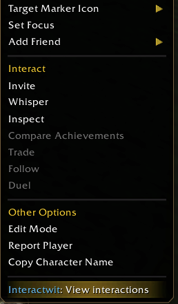
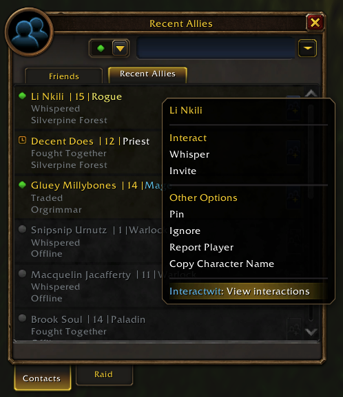
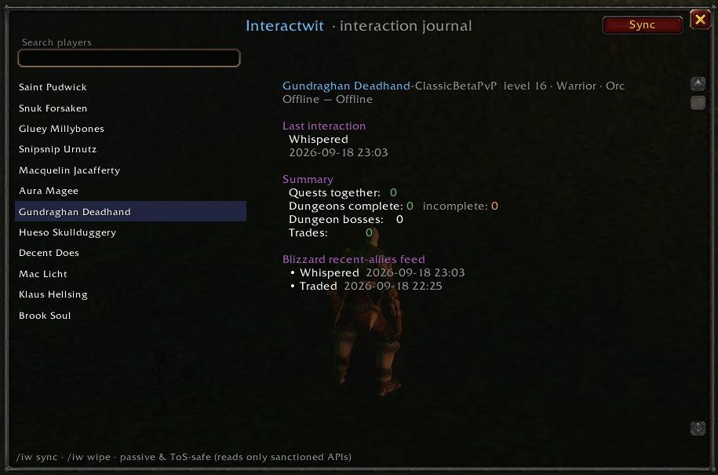

# Interactwit

A social **interaction journal** for **World of Warcraft: Forever**. It quietly
remembers the players you group with and how you've interacted with them:

- **Quests completed together**, and the **zones** you did them in
- **Dungeons** you ran together — marked **complete** or **incomplete** (i.e. you
  killed a boss or two with them but never finished the run)
- **Completed trades** (items + gold, both directions)
- A **last interacted** summary — what you last did with them and when

It also mirrors Blizzard's own **"recently interacted"** feed (the new Friends-list
tab) so you get their data *and* your own richer history in one place.

## Screenshots

Right-click a player's unit frame for a **View interactions** shortcut:



The same shortcut is added to entries in the **Recent Allies** list:



The journal window shows everything you've done with that player:



---

## Is this safe? Will I get banned?

**No.** This addon is deliberately built to stay entirely inside Blizzard's rules.

Blizzard's line has always been simple and consistent: **"Within the API = good,
external to the API = bad."** Accounts get actioned for *external* programs that
automate input, broadcast keystrokes, read game memory, or modify the client — none
of which an addon can even do. Addons run in a locked-down Lua sandbox with **no
file, network, or OS access**; SavedVariables (managed by the client) is the *only*
way an addon may persist data.

Interactwit specifically:

- **Only reads sanctioned APIs** and reacts to normal game events
  (`QUEST_TURNED_IN`, `ENCOUNTER_END`, trade events, `C_RecentAllies`).
- **Never touches combat or "secret" values.** WoW: Forever inherits Midnight's
  "addon disarmament" (secret health/aura values, protected combat data). This
  addon reads *none* of that, so it's unaffected by those restrictions.
- **Never automates anything** — it casts nothing, moves nothing, clicks nothing.
- **Stores everything locally** in SavedVariables. No network, ever.

In short: it's a passive notebook. It has the same risk profile as any friends/notes
addon.

---

## Requirements

- **World of Warcraft: Forever** (beta). Forever uses the modern Mainline API
  (~12.1.5) and the `C_RecentAllies` system, which is confirmed present in the
  Forever client (build 1.60.1). It should also work on modern Retail/Midnight.

---

## Install

1. Copy the **`Interactwit`** folder into your Forever install's AddOns directory:

   ```
   World of Warcraft/<forever-flavor-folder>/Interface/AddOns/Interactwit
   ```

   The flavor folder for Retail is `_retail_`; for the Forever beta it's the
   equivalent Forever/beta folder created by the Battle.net client. The `Interactwit`
   folder must contain `Interactwit.toc` directly (not nested in another folder).

2. Restart WoW (or reload with `/reload`).
3. At the character-select screen, click **AddOns** and make sure Interactwit is
   enabled.

### If it shows as "Out of Date"

The beta's build number changes often, so the `## Interface:` line in
`Interactwit.toc` may not match. Either:

- Tick **"Load out of date AddOns"** on the AddOns screen, **or**
- In-game, run `/dump (select(4, GetBuildInfo()))` and put that number in the
  `## Interface:` line at the top of `Interactwit.toc`.

---

## Usage

| Command        | Action                                                        |
| -------------- | ------------------------------------------------------------- |
| `/iw`          | Open / close the journal window                               |
| `/interactwit` | Same as `/iw`                                                 |
| `/iw sync`     | Refresh from Blizzard's recent-allies feed                    |
| `/iw wipe`     | **Erase all stored data** (cannot be undone)                  |

In the window: search by name on the left, click a player to see the full breakdown
on the right. **Sync** pulls the latest from Blizzard's recent-allies feed.

### Right-click shortcuts

Interactwit adds an **"Interactwit: View interactions"** entry to right-click menus,
so you can jump straight to someone's history:

- **Recent Allies list** — right-click any entry (the exact list from your
  screenshot) and pick the option to open their history.
- **Unit frames & names** — right-click a player's unit frame (target, party, raid),
  or their name in social lists, and pick the same option.

This uses Blizzard's modern `Menu.ModifyMenu` hook system (the sanctioned, taint-free
way to append to menus). If a player has no recorded history yet, the window opens
with a friendly "nothing recorded yet" note and fills in as you play together.

---

## How tracking works (and its limits)

- **Quests:** when you turn in a quest *while grouped*, it's credited to every group
  member, tagged with the current zone. Solo turn-ins are ignored (nobody to credit).
- **Dungeon bosses:** each successful `ENCOUNTER_END` in a 5-player dungeon credits a
  boss kill to everyone in your group at that moment.
- **Dungeon complete vs incomplete:** a run is marked **complete** when any of these
  fire — (1) a Dungeon Finder completion reward, (2) Blizzard's own
  `CompleteDungeon` interaction for a groupmate during the run, or (3) a known
  **final boss** dies (see `FinalBosses.lua`). If you kill a boss or two and then
  leave without a completion signal, the run is saved as **incomplete**.
- **Trades:** a trade is recorded only after it actually completes
  (`ERR_TRADE_COMPLETE`), capturing items and gold both ways. Cancelled trades are
  ignored.

### Making dungeon completion 100% reliable for manual groups

Dungeon Finder runs auto-detect completion. For **manually-formed** groups, the most
reliable signal is knowing the dungeon's **final boss**. That list is intentionally
empty by default because encounter IDs differ per game version and Forever is in
beta. To populate it for your client:

1. `/run InteractwitDB.debug = true` (turns on chat debug).
2. Run a dungeon; each boss prints its `encounterID` to chat.
3. Add the final boss to `FinalBosses.lua`:
   `ns.FINAL_BOSSES[<encounterID>] = "Dungeon Name"`
4. `/reload`.

Even without this, incomplete/complete is inferred from the other two signals and
you always get the boss-kill counts.

---

## Data & storage

Everything lives in `WTF/Account/<account>/SavedVariables/Interactwit.lua` as
`InteractwitDB` — the standard, sanctioned addon storage. Per-player history is
capped (250 quests / 100 dungeons / 100 trades by default; see `Constants.lua`) so
the file stays small.

---

## Files

| File             | Purpose                                                      |
| ---------------- | ----------------------------------------------------------- |
| `Interactwit.toc`| Addon manifest / load order                                 |
| `Constants.lua`  | Config, RolodexType labels, colors                          |
| `Core.lua`       | DB bootstrap, utilities, event dispatch, slash command      |
| `FinalBosses.lua`| Optional final-boss lookup for completion detection         |
| `Tracker.lua`    | Records quests, dungeons, trades; syncs recent allies       |
| `UI.lua`         | The journal window                                          |
| `Menus.lua`      | Adds "View interactions" to right-click menus               |
